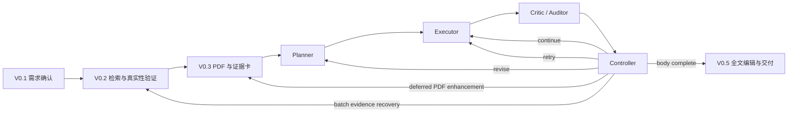

# VeriWrite Agent

面向课程综述论文的证据约束型写作 Agent。它把课程要求、真实文献、PDF
页码证据、段落写作计划、引用绑定和最终合规审计连接成一条可恢复工作流。

> 当前状态：MVP 1.0，持续完善 V0.4/V0.5 Agent 闭环。项目优先证明
> “可验证、可追溯、可恢复”，不把一次顺利的模型输出当作系统可靠性。

## 为什么做这个项目

普通 LLM 直接生成课程论文时，常见问题包括：

- 遗漏课程要求或错误解释数量、年份和来源限制；
- 生成虚假 DOI、无关文献或错位的参考文献；
- 论断无法追溯到核心 PDF 的证据卡与页码；
- 刷新、断网或模型输出异常后需要整篇重来；
- 固定工作流不能根据审计结果定点返修、回退或继续。

VeriWrite 的核心设计边界是：**LLM 提出语义候选，确定性代码决定候选是否可被接受、执行和持久化。**

| LLM 负责 | 确定性代码负责 |
| --- | --- |
| 需求提取与冲突解释 | Pydantic 数据合同与状态迁移 |
| 检索规划与主题相关性判断 | DOI/RIS 身份验证与准入规则 |
| 段落规划、正文组织与审稿 | PDF 身份、证据权限、页码与引用绑定 |
| 全文编辑与学术表达 | 字数、来源、课程要求与交付门禁 |

## 系统工作流



V0.4 页面只暴露“开始/继续 Agent 写作”和暂停控制。Controller 根据审计结果选择：

- `continue`：确认当前章节并进入下一章；
- `retry`：只重写失败段落；
- `revise`：重建受影响章节的证据与段落计划；
- `rollback`：合并证据缺口，批量回到检索或证据节点；
- `request_user`：只处理付费 PDF、需求冲突等系统无法自行解决的问题。

缺少核心 PDF 时，Agent 不会逐段反复打断用户。它会先把允许由元数据支持的内容收缩为
一般背景并留下待增强标记；全文完成后汇总 PDF 补充清单，再定点增强受影响段落。

## 可靠性机制

- 每个阶段保存本地检查点，刷新和网络故障只重做失败节点；
- 章节级与段落级运行缓存避免重复消耗模型调用；
- 未知 DOI、PDF 身份冲突、来源越权和无证据主张属于硬门禁；
- 学术表达、段落长度和局部衔接进入有限次数定点编辑；
- 非文字依赖错误不会被错误地送入“重写措辞”循环；
- 独立全文编辑只重开问题段落，不覆盖已确认章节；
- 内部事实审计与外部 hermes-rubric 评分分离，外部分数不能替代证据门禁；
- FakeLLM 离线验收覆盖暂停、断网、恢复、V0.4、V0.5 和 DOCX 导出。

更详细的状态机和门禁说明见
[V0.4/V0.5 Agent loop](docs/v04_v05_agent_loop.md) 与
[Agent runtime contracts](docs/agent_runtime_contracts.md)。

## 快速开始

要求：Windows 或兼容的 Python 环境，Python 3.11 及以上。

```powershell
git clone <your-repository-url>
cd veriwrite-agent
python -m venv .venv
.\.venv\Scripts\Activate.ps1
python -m pip install --upgrade pip
python -m pip install -e ".[dev,ui,ocr,evaluation]"
Copy-Item .env.example .env
```

在 `.env` 中至少设置：

```dotenv
LLM_API_KEY=your-api-key
LLM_BASE_URL=https://api.deepseek.com
LLM_STRUCTURED_MODEL=deepseek-chat
LLM_REVIEWER_MODEL=deepseek-chat
```

核心 PDF 默认扫描目录为：

```text
~/Documents/VeriWrite/Evidence-Vault
```

可以通过本地 `.env` 覆盖，路径不会被提交：

```dotenv
VERIWRITE_EVIDENCE_VAULT=D:\Research\VeriWrite-Evidence
```

启动工作台：

```powershell
.\.venv\Scripts\python.exe -m streamlit run streamlit_app.py --server.headless true
```

访问 <http://localhost:8501/>。

## 测试与离线验收

```powershell
.\.venv\Scripts\python.exe -m pytest -q
.\.venv\Scripts\python.exe -m ruff check .
```

对本地已保存项目运行无网络 V0.4 → V0.5 → DOCX 验收：

```powershell
.\.venv\Scripts\python.exe scripts\smoke_offline_agent.py
```

该脚本使用真实项目合同和确定性 FakeLLM，不修改快照、不调用 DeepSeek。
没有本地 runtime 快照时，全量 pytest 仍提供自包含的金标准和故障注入覆盖。

独立 evaluator 位于 `veriwrite-evaluator/`，MCP 接入说明见
[External evaluator MCP](docs/external_evaluator_mcp.md)。

## 项目结构

```text
veriwrite-agent/
├── src/veriwrite_agent/
│   ├── models/             # Pydantic 数据合同
│   ├── services/           # 检索、证据、写作、审计与恢复服务
│   ├── llm/                # OpenAI-compatible provider adapter
│   └── ui/                 # Streamlit 产品工作台
├── veriwrite-evaluator/    # 独立 MCP 全文评估器
├── tests/                  # 单元、回归、金标准和故障注入测试
├── scripts/                # 诊断、离线验收和 Windows 启动器
├── docs/                   # PRD、架构决策与阶段设计
├── data/                   # 版本化期刊目录及其来源说明
└── streamlit_app.py        # 应用入口
```

## 隐私与数据边界

- `.env`、`runtime/`、原始 PDF、上传文件、日志和生成论文默认不进入 Git；
- API Key 只从环境变量或本地 `.env` 读取；
- PDF 证据与项目检查点保存在本地；
- 示例、截图和 bug 报告在公开前应移除课程内容、论文正文和个人路径；
- 不要把真实 runtime 项目提交到 Issue 或 Pull Request。

第三方目录的来源与许可边界见 [data/README.md](data/README.md)。

## 当前边界

- 出版社登录、验证码和付费全文仍需要用户处理；
- 外部评分是对照信号，不读取隐藏答案，也不直接驱动写作循环；
- 当前逐句支持关系由段落证据包、证据卡与页码约束，语义蕴含审计仍在持续增强；
- 项目不会绕过课程的 AI 使用政策，禁止 AI 生成正文时会在模型调用前停止。

## 设计文档

- [MVP PRD](docs/M0_PRD.md)
- [V0.2 文献发现设计](docs/v0.2_literature_discovery_design.md)
- [V0.3 证据矩阵设计](docs/v0.3_evidence_matrix_design.md)
- [V0.4 证据约束写作设计](docs/v0.4_grounded_writing_design.md)
- [可执行要求与最终交付](docs/mvp_executable_policy_and_delivery.md)
- [开放源码方案对照](docs/open_source_writing_agent_adoption.md)

## 使用与许可

本仓库目前用于个人作品集与技术评审。除第三方数据各自标注的许可外，仓库尚未授予
通用开源许可；如需复用代码，请先联系仓库所有者。课程论文和文献全文不属于本仓库发布内容。
